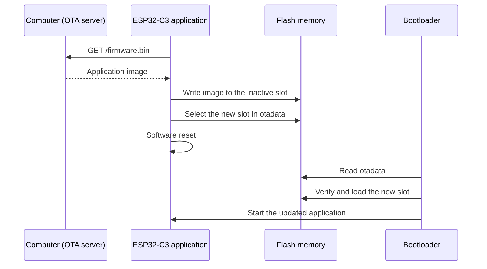

# Over-the-Air Updates

In this chapter we teach the device to update its own firmware. The board periodically asks a server on your computer for a new application image, writes the image to a spare region of flash, and reboots into it. The completed code for this chapter is available in `project/part5/`.

Wi-Fi provisioning and the MQTT task from [Wi-Fi Provisioning](./wifi-provisioning.md) stay the same. The main changes are a custom partition table, flash access from the application, a task that downloads and installs new firmware, and a status LED that shows what the device is doing.

## What Is an OTA Update?

Until now, every new version of the firmware reached the board through the USB cable and `espflash`. Once a device is installed in the field, that cable is gone. An **Over-the-Air (OTA) update** delivers the new firmware through the network connection the device already has.

The difficult part is not the download, but replacing the program that is currently running. The application cannot overwrite itself while it executes, and a power loss in the middle of the update must not leave the device without working firmware.

ESP-IDF solves this with an A/B scheme:

1. The flash holds more than one application slot. The application runs from one slot and writes the new image to another.
2. A small data partition, `otadata`, records which slot should boot next.
3. Only after the new image is completely written does the application update `otadata` and reboot.
4. The second-stage bootloader reads `otadata` and starts the selected slot.

If the download fails halfway, `otadata` still points to the old slot and nothing is lost. Our application uses the same ESP-IDF bootloader as before, so it follows these rules too.

The full update flow looks like this:



## Creating the Partition Table

The ESP32-C3 flash is divided into regions. The second-stage bootloader is at the start of the flash, and the **partition table** at offset `0x8000` describes everything after it: where each partition starts, how large it is, and what it contains. The format is described in the ESP-IDF [Partition Tables][idf-partition-tables] guide.

In the previous chapters we never provided a partition table, so `espflash` used its default one. It contains a single application partition, `factory`, and no room for a second image. For OTA we write our own table in `project/part5/partitions.csv`:

```csv
{{#include ../../project/part5/partitions.csv}}
```

Each row describes one partition:

- **Name** is a label used to find the partition, for example in tools and logs.
- **Type** is `app` for partitions that contain firmware and `data` for everything else.
- **SubType** refines the type. It tells the bootloader which partition is the factory image, which ones are OTA slots, and where the OTA data lives.
- **Offset** and **Size** place the partition in flash.
- **Flags** can mark a partition as encrypted or read-only. We do not use them.

The partitions in our table are:

| Partition  | Purpose                                                                                       |
| ---------- | --------------------------------------------------------------------------------------------- |
| `nvs`      | Non-volatile storage, a key-value store for data such as settings. Unused in this training.  |
| `otadata`  | Records which OTA slot to boot. It holds two copies of the boot selection, so an interrupted write never corrupts both. |
| `phy_init` | Radio calibration data used by the Wi-Fi driver.                                              |
| `factory`  | The application flashed with `espflash`. The bootloader starts it when `otadata` is empty.   |
| `ota_0`    | First OTA slot.                                                                               |
| `ota_1`    | Second OTA slot.                                                                              |

A few rules shape the layout:

- The partition table itself occupies offset `0x8000`, so the first partition starts at `0x9000`.
- Application partitions must start at an offset aligned to 64 KiB (`0x10000`). This is why `factory` starts at `0x10000` and each slot starts exactly 1 MiB after the previous one.
- `otadata` must be `0x2000` bytes, enough for the two copies of the boot selection.
- Every application image must fit in its slot. With three 1 MiB application partitions, the table uses a little more than 3 MiB of the 4 MiB flash on the ESP32-C3-DevKit-RUST-2.

The `factory` partition is not strictly required for OTA, because the bootloader can start from `ota_0` directly. Keeping it means that the image flashed over USB stays untouched, and updates alternate between `ota_0` and `ota_1`.

You can ask `espflash` to parse the CSV file and print the resulting table, which is a quick way to catch typos and overlapping partitions:

```shell
espflash partition-table partitions.csv
```

### Flashing With the Partition Table

To use our table, the Cargo runner passes it to `espflash`:

```toml
{{#include ../../project/part5/.cargo/config.toml:runner}}
```

`espflash` now writes the bootloader, our partition table, and the application. It always places the application in the `factory` partition.

`espflash` does not erase `otadata` by default. After the device has installed an OTA update, `otadata` points to an OTA slot, and the bootloader keeps starting that slot even if you flash a new image to `factory` with `cargo run`. To boot the freshly flashed image, erase `otadata` while flashing:

```shell
cargo run --release -- --erase-data-parts ota
```

Arguments after `--` are passed to the runner, so `espflash` receives `--erase-data-parts ota` and erases every `data` partition with the `ota` subtype.

## Accessing the Flash

The application needs to read the partition table and write to the OTA slots. Two crates provide this:

```toml
{{#include ../../project/part5/Cargo.toml:esp_bootloader_esp_idf}}
{{#include ../../project/part5/Cargo.toml:esp_storage}}
```

- [`esp-storage`][esp-storage] provides [`FlashStorage`][flash-storage], a driver for the SPI flash chip that implements the [`embedded-storage`][embedded-storage] traits.
- [`esp-bootloader-esp-idf`][esp-bootloader-esp-idf] has been part of the project from the start, because `esp_app_desc!()` creates the application descriptor that the ESP-IDF bootloader expects. It also understands the partition table and `otadata`.

At startup, `main` creates the flash driver, reads the partition table, and logs which partition is running:

```rust,ignore
{{#shiftinclude auto:../../project/part5/src/main.rs:flash_storage}}
```

[`read_partition_table`][read-partition-table] parses the table into the buffer, and [`booted_partition`][partition-table] reports the partition the running code was loaded from. This log line is how we will tell whether the device is running from `factory`, `ota_0`, or `ota_1`.

The flash driver is created once in `main`, but the OTA task uses it much later. We move it into a static:

```rust,ignore
{{#include ../../project/part5/src/ota.rs:flash_storage_static}}
```

The [`embassy-sync` `Mutex`][embassy-mutex] guarantees that only one task accesses the flash at a time. The value is wrapped in an `Option` because a static must be initialized at compile time, while `FlashStorage` can only be created at runtime from the `FLASH` peripheral. `main` stores `Some(flash)` after initialization, and the OTA task locks the mutex when it needs to write.

## Creating the Application Image

`cargo build` produces an ELF file in `target/riscv32imc-unknown-none-elf/release/no_std-training`. An ELF file contains everything a debugger needs, such as symbols and debug information, but the ESP32-C3 cannot boot it directly. Until now, `espflash flash` converted the ELF file into an **application image** on the fly and wrote it to the `factory` partition.

For an OTA update, we need that application image as a file, so that a server can send it to the device. `espflash save-image` performs the same conversion and saves the result. Run it from `project/part5/` after a release build:

```shell
mkdir -p ota
espflash save-image --chip esp32c3 --partition-table partitions.csv target/riscv32imc-unknown-none-elf/release/no_std-training ota/firmware.bin
```

`save-image` does not create missing directories, so `mkdir -p ota` comes first. The repository's `.gitignore` already excludes `ota/` directories, so the generated image is never committed.

The resulting `firmware.bin` is exactly what belongs in an application partition, in the [ESP-IDF application image format][idf-app-image]:

- An image header that starts with the magic byte `0xE9` and describes the chip and flash settings.
- The application segments: code and data, each with the address it must be loaded to.
- The application descriptor created by `esp_app_desc!()`, with the crate version and project name from `Cargo.toml`, and the build date and time. It sits at the start of the first segment, at a fixed offset, so the device can read the version of an image from its first bytes.
- A checksum and a SHA-256 digest that the bootloader verifies before it starts the image.

The image does not contain the bootloader or the partition table. Those are already on the device and do not change during an OTA update. Do not use the `--merge` option here: it produces a full flash image, with the bootloader and partition table, which only makes sense when writing the flash from offset `0`.

Passing `--partition-table` also makes `espflash` check the image against the size of our application partitions instead of its default `factory` partition:

```text
App/part. size:    718,080/1,048,576 bytes, 68.48%
```

The exact size depends on your build. If the image ever grows past 1 MiB, it no longer fits in an OTA slot, and you need to change the partition table on every device, which an OTA update cannot do.

## Serving the Image Over HTTP

The device downloads the image with a plain HTTP `GET` request. The repository's `xtask` includes a small server for this. Run it from the repository root, pointing it to the image created above:

```shell
cargo xtask ota-server --firmware project/part5/ota/firmware.bin
```

The server reads the file into memory and answers `GET /firmware.bin` on port `8080`. Every response contains the whole image, with a `Content-Length` header and `Connection: close`. Any other path returns `404 Not Found`. Like the MQTT broker, it prints the host IP address the device should use:

```text
OTA server listening on 0.0.0.0:8080
Host IP (best effort): 192.168.1.10
Example: `HOST_IP="192.168.1.10" cargo r -r`
Remote devices should connect to 192.168.1.10:8080
Serving `GET /firmware.bin` from `project/part5/ota/firmware.bin` (718080 bytes).
```

The server reads the file only at startup. After you create a new image, restart the server so it serves the new file.

`--port` changes the port, but the firmware always connects to port `8080`, so changing it also requires changing the firmware. The file name in `--firmware` can be anything, because the URL is always `/firmware.bin`.

To check the server without a device, download the image with `curl` and compare it with the original:

```shell
curl -o /tmp/firmware.bin http://127.0.0.1:8080/firmware.bin
cmp /tmp/firmware.bin project/part5/ota/firmware.bin
```

## The OTA Client Task

On the device, the OTA logic lives in `project/part5/src/ota.rs`. `main` spawns its task, `http_client_task`, together with the status LED task described later:

```rust,ignore
{{#shiftinclude auto:../../project/part5/src/main.rs:spawn_ota}}
```

The task receives the station stack, because the OTA server is reachable through the network the device joins after provisioning. Its first step is `stack.wait_config_up()`, so like `mqtt_task`, it waits until provisioning is complete and DHCP has configured the station.

### Checking Periodically

The device does not know when a new image is available, so it asks at a fixed interval. The interval is read at compile time:

```rust,ignore
{{#include ../../project/part5/src/ota.rs:ota_interval}}
```

The default is 300 seconds. Set `OTA_CHECK_INTERVAL_SECS` when building to check more often, which is convenient while testing. Values that are missing, zero, or not a number fall back to the default.

The OTA server address comes from the same `HOST_IP` variable as the MQTT broker, since both servers run on your computer. Unlike the MQTT task, the OTA task does not resolve hostnames: `HOST_IP` must be an IPv4 address. If it is missing or not an address, the task skips the check and tries again after the interval.

### Requesting the Image

Each check is handled by `update_firmware`. It uses the client side of [`edge-http`][edge-http-client], the crate that served the provisioning page in the previous chapter, on top of an [`edge-nal-embassy`][edge-nal-embassy] TCP connection to port `8080` of the host:

```rust,ignore
{{#shiftinclude auto:../../project/part5/src/ota.rs:http_request}}
```

- `TcpBuffers::<1, 1024, 4096>` provides the buffers for one TCP socket: 1 KiB to send the request and 4 KiB to receive the image.
- [`WithTimeout`][with-timeout] gives every network operation a 30-second limit, so a check that stalls, for example because the computer left the network, ends with an error.
- `initiate_request` connects and sends `GET /firmware.bin`. The first argument selects `HTTP/1.0` instead of `HTTP/1.1`, which asks the server to close the connection after the response.
- `initiate_response` reads the status line and headers into `http_buffer`.

If the server is not running, the connection fails, the task logs the error, and it tries again after the interval:

```text
ERROR - HTTP Client: Request error: Io(Error(Connect(ConnectionReset)))
```

### Checking the Response

A response is not necessarily an image. The server might answer `404 Not Found`, or a different program might be listening on port `8080`. Before touching the flash, the task checks the headers:

```rust,ignore
{{#shiftinclude auto:../../project/part5/src/ota.rs:check_response}}
```

[`split`][edge-http-client] separates the parsed headers from the body. Only `200 OK` is accepted, and the response must announce its size in `Content-Length`, so that the task can later tell a complete download from one that was cut short.

### Checking the Version

The server offers the same image at every check, so the device must decide whether it needs it. The application descriptor answers this: it stores the crate version from `Cargo.toml` at a fixed offset near the start of every image. The layout is described by a few constants:

```rust,ignore
{{#include ../../project/part5/src/ota.rs:image_layout}}
```

The task reads the first 80 bytes of the body, which end exactly after the version field, and compares the version with the one of the running firmware:

```rust,ignore
{{#shiftinclude auto:../../project/part5/src/ota.rs:check_version}}
```

`image_version` checks both magic numbers before it trusts the bytes in between:

```rust,ignore
{{#include ../../project/part5/src/ota.rs:image_version}}
```

- An image starts with `0xE9`, and the application descriptor starts with `0xABCD5432`. A `404` page, a text file, or any other data fails these checks, and the task stops with `Response is not an application image`.
- The version field is 32 bytes long and padded with zero bytes, so the string ends at the first zero.

The running version comes from `ESP_APP_DESC`, the static created by `esp_app_desc!()` in `main.rs`. If both versions are equal, `update_firmware` returns `Ok(false)` and closes the connection without downloading the rest. To publish an update, you increase `version` in `Cargo.toml`.

The comparison only checks whether the versions differ. A server that offers an older version than the running one would install it as well.

### Writing the Image to Flash

Once the image is known to be new, the task locks `FLASH_STORAGE` and creates an [`OtaUpdater`][ota-updater]:

```rust,ignore
{{#shiftinclude auto:../../project/part5/src/ota.rs:ota_updater}}
```

`OtaUpdater::new` reads the partition table again and checks that it contains an `otadata` partition and at least two OTA slots. With the default `espflash` partition table, this step fails.

[`next_partition`][ota-updater] decides which slot receives the update. It reads `otadata` to find the currently selected slot and picks the following one: `ota_0` after `factory`, `ota_1` after `ota_0`, and `ota_0` again after `ota_1`. It never returns the slot the application is running from. The returned [`FlashRegion`][flash-region] covers only that partition, with offsets relative to its start, so the task cannot write to the running application, the bootloader, or any other partition by mistake.

The task then writes the image in the order it arrives:

```rust,ignore
{{#shiftinclude auto:../../project/part5/src/ota.rs:write_firmware}}
```

First, the 80 bytes already read for the version check are written at offset `0`. Then, each chunk of up to 4 KiB from the body is written right after the previous one. The body reader stops at `Content-Length`, and a read that returns `0` bytes ends the loop.

A read also returns `0` bytes when the server closes the connection early, so the end of the loop does not prove that the image is complete. The task compares the number of written bytes with `Content-Length` and refuses a partial image:

```text
ERROR - HTTP Client: Download incomplete (359040 of 718080 bytes)
```

The image is never held in RAM as a whole. With roughly 700 KB of firmware and about 100 KB of heap, it could not be. Flash can only change bits from `1` to `0`, so it must be erased before it is written. The `write` method of the [`Storage`][embedded-storage-storage] trait handles this: it erases each 4 KiB sector as needed and preserves the parts of the sector it does not overwrite.

### Activating the New Image

After the whole image is in the slot, the task tells the bootloader to use it:

```rust,ignore
{{#shiftinclude auto:../../project/part5/src/ota.rs:activate_partition}}
```

- [`activate_next_partition`][ota-updater] writes a new entry to `otadata` that selects the slot we just filled. This is the moment the update takes effect: before this call, a reset boots the old firmware, and after it, a reset boots the new one.
- [`set_current_ota_state`][ota-updater] marks the new slot as [`OtaImageState::New`][ota-image-state], a freshly installed image that has not run yet. A bootloader with rollback support uses this state to detect an update that never confirms it works. See [Limitations](#limitations).

Back in the task loop, a reset follows only when `update_firmware` returns `Ok(true)`, that is, when a new image was installed:

```rust,ignore
{{#shiftinclude auto:../../project/part5/src/ota.rs:apply_update}}
```

[`software_reset`][software-reset] restarts the chip. The bootloader reads `otadata`, verifies the checksum and SHA-256 digest of the image in the selected slot, and starts it. If the verification fails, the ESP-IDF bootloader falls back to another bootable application partition.

If any step fails before `activate_next_partition`, the function returns an error, the old firmware keeps running, and the task tries again after the interval. An up-to-date firmware also keeps running and checks again after the interval.

## Status LED

The ESP32-C3-DevKit-RUST-2 has an addressable RGB LED connected to GPIO2. `status_led_task` drives it with the RMT peripheral, which generates the precise pulse timing the LED expects. Other tasks report their state through an [`embassy-sync` `Signal`][embassy-signal], `LED_STATUS`, and the LED task picks the color:

```rust,ignore
{{#shiftinclude auto:../../project/part5/src/status_led.rs:led_colors}}
```

| Color | State          | Set by                                                     |
| ----- | -------------- | ---------------------------------------------------------- |
| Green | `Provisioning` | `main`, while the provisioning portal is running.          |
| Off   | `Idle`         | The OTA task, once the station is connected and between checks. |
| Blue  | `Updating`     | The OTA task, while it contacts the server and downloads.  |

A `Signal` only keeps the most recent value, which is exactly what a status indicator needs: the LED task does not care about states it missed, only about the current one.

## Running the Application

This walkthrough flashes the application, provisions it, and then updates it with a newer version of itself. Each of the servers runs in its own terminal.

Start the MQTT broker from the repository root:

```shell
cargo xtask mqtt-server
```

In another terminal, change to `project/part5/` and flash the application. A short check interval makes the update happen quickly:

```shell
HOST_IP="your-ip" OTA_CHECK_INTERVAL_SECS=30 cargo run --release -- --erase-data-parts ota
```

Replace `your-ip` with the host IP printed by `cargo xtask mqtt-server`. Erasing `otadata` makes sure the device starts from the `factory` partition, even if an earlier run left an OTA slot selected.

The first log line shows the partition the device booted from:

```text
INFO - Currently booted partition Ok(Some(PartitionEntry { magic: 20650, raw_type: 0, raw_subtype: 0, offset: 65536, len: 1048576, label: "factory", flags: 0, is_read_only: false, is_encrypted: false }))
```

The provisioning portal instructions from the previous chapter follow, and the LED turns green.

Provision the device as described in [Wi-Fi Provisioning](./wifi-provisioning.md#running-the-application). Once the station is connected, the LED turns off, the MQTT task publishes measurements, and the OTA task starts its checks:

```text
INFO - HTTP Client: Periodic OTA checks enabled (every 30s)
```

No OTA server is running yet, so every check logs a connection error and the old firmware keeps running.

### Building the Update

The device only installs an image with a different version, so increase `version` in `project/part5/Cargo.toml`:

```toml
version      = "0.2.0"
```

Build it with the same environment variables as before. They are baked into the firmware, so an update built without `HOST_IP` would not find the MQTT broker or the OTA server:

```shell
HOST_IP="your-ip" OTA_CHECK_INTERVAL_SECS=30 cargo build --release
mkdir -p ota
espflash save-image --chip esp32c3 --partition-table partitions.csv target/riscv32imc-unknown-none-elf/release/no_std-training ota/firmware.bin
```

Do not use `cargo run` here, because it would flash the new firmware over USB.

### Applying the Update

In a third terminal, start the OTA server from the repository root:

```shell
cargo xtask ota-server --firmware project/part5/ota/firmware.bin
```

At the next check, the LED turns blue, the server prints `Serving firmware.bin` with the image size, and the device logs the update:

```text
INFO - HTTP Client: Updating firmware 0.1.0 -> 0.2.0
INFO - HTTP Client: Partition activated successfully
INFO - HTTP Client: OTA update complete
INFO - HTTP Client: Rebooting into updated firmware
```

The device then resets and boots the new image from `ota_0`:

```text
INFO - Currently booted partition Ok(Some(PartitionEntry { magic: 20650, raw_type: 0, raw_subtype: 16, offset: 1114112, len: 1048576, label: "ota_0", flags: 0, is_read_only: false, is_encrypted: false }))
```

The Wi-Fi credentials only lived in RAM, so the updated device starts the provisioning portal again, and the LED turns green. Provision it once more to reconnect it to the network and the MQTT broker.

The OTA server keeps offering the same image, but the device now runs that version, so the following checks leave it alone:

```text
INFO - HTTP Client: Firmware 0.2.0 is up to date
```

Each of these checks closes the connection after the first bytes of the image, so the server prints `failed to write HTTP response body: Broken pipe` after `Serving firmware.bin`. This is expected.

To return to the original firmware, flash it again over USB with `--erase-data-parts ota`, as in the first step.

## Limitations

This example shows the complete OTA mechanism, but a product needs more around it:

- **The version check is minimal.** The device opens a download at every check just to read the version, and installs any version that differs from its own, including an older one. A real device would ask the server for the latest version first, for example through a small metadata file, and only install newer versions.
- **The image is only partly validated before activation.** The client checks the status code, the magic numbers, and the length, but not the checksum or the SHA-256 digest. A corrupted image is only rejected by the bootloader at the next boot.
- **The download is not authenticated.** The image travels over plain HTTP from whichever host answers on `HOST_IP`. Anyone who can impersonate that host can install their own firmware. Production devices download over HTTPS and verify signed images, for example with [Secure Boot][idf-secure-boot].
- **There is no rollback.** The new image is marked `New` but never confirms that it works by setting its state to `Valid`. A bootloader built with [app rollback][idf-app-rollback] support (`CONFIG_BOOTLOADER_APP_ROLLBACK_ENABLE` in ESP-IDF) boots such an image once, and returns to the previous slot at the next reset if the image has not confirmed itself by then. Using rollback requires that bootloader and a firmware that marks itself `Valid` once it has checked that it works, for example after reconnecting to the MQTT broker.
- **Credentials are lost on every update.** As noted in the previous chapter, the Wi-Fi credentials are not stored in flash, so each reboot, including the one after an update, requires provisioning the device again. The `nvs` partition in our table is where they could be stored.

With OTA updates in place, a device that is provisioned once can receive new firmware for the rest of its life without a cable. In [Wrapping Up](./wrapping-up.md) we will review what we built.

[idf-partition-tables]: https://docs.espressif.com/projects/esp-idf/en/latest/esp32c3/api-guides/partition-tables.html
[idf-app-image]: https://docs.espressif.com/projects/esp-idf/en/latest/esp32c3/api-reference/system/app_image_format.html
[idf-secure-boot]: https://docs.espressif.com/projects/esp-idf/en/latest/esp32c3/security/secure-boot-v2.html
[idf-app-rollback]: https://docs.espressif.com/projects/esp-idf/en/latest/esp32c3/api-reference/system/ota.html#app-rollback
<!-- TODO: Use /latest/ when new docs are redeployed -->
[esp-storage]: https://docs.espressif.com/projects/rust/esp-storage/0.9.0/esp32c3/esp_storage/
[flash-storage]: https://docs.espressif.com/projects/rust/esp-storage/0.9.0/esp32c3/esp_storage/struct.FlashStorage.html
[esp-bootloader-esp-idf]: https://docs.espressif.com/projects/rust/esp-bootloader-esp-idf/0.5.0/esp32c3/esp_bootloader_esp_idf/
[read-partition-table]: https://docs.espressif.com/projects/rust/esp-bootloader-esp-idf/0.5.0/esp32c3/esp_bootloader_esp_idf/partitions/fn.read_partition_table.html
[partition-table]: https://docs.espressif.com/projects/rust/esp-bootloader-esp-idf/0.5.0/esp32c3/esp_bootloader_esp_idf/partitions/struct.PartitionTable.html
[flash-region]: https://docs.espressif.com/projects/rust/esp-bootloader-esp-idf/0.5.0/esp32c3/esp_bootloader_esp_idf/partitions/struct.FlashRegion.html
[ota-updater]: https://docs.espressif.com/projects/rust/esp-bootloader-esp-idf/0.5.0/esp32c3/esp_bootloader_esp_idf/ota_updater/struct.OtaUpdater.html
[ota-image-state]: https://docs.espressif.com/projects/rust/esp-bootloader-esp-idf/0.5.0/esp32c3/esp_bootloader_esp_idf/ota/enum.OtaImageState.html
[software-reset]: https://docs.espressif.com/projects/rust/esp-hal/1.1.1/esp32c3/esp_hal/system/fn.software_reset.html
[embedded-storage]: https://docs.rs/embedded-storage/0.3.1/embedded_storage/
[embedded-storage-storage]: https://docs.rs/embedded-storage/0.3.1/embedded_storage/trait.Storage.html
[embassy-mutex]: https://docs.rs/embassy-sync/0.8.0/embassy_sync/mutex/struct.Mutex.html
[embassy-signal]: https://docs.rs/embassy-sync/0.8.0/embassy_sync/signal/struct.Signal.html
[edge-http-client]: https://docs.rs/edge-http/0.7.0/edge_http/io/client/enum.Connection.html
[edge-nal-embassy]: https://docs.rs/edge-nal-embassy/0.8.1/edge_nal_embassy/
[with-timeout]: https://docs.rs/edge-nal/0.6.0/edge_nal/struct.WithTimeout.html
