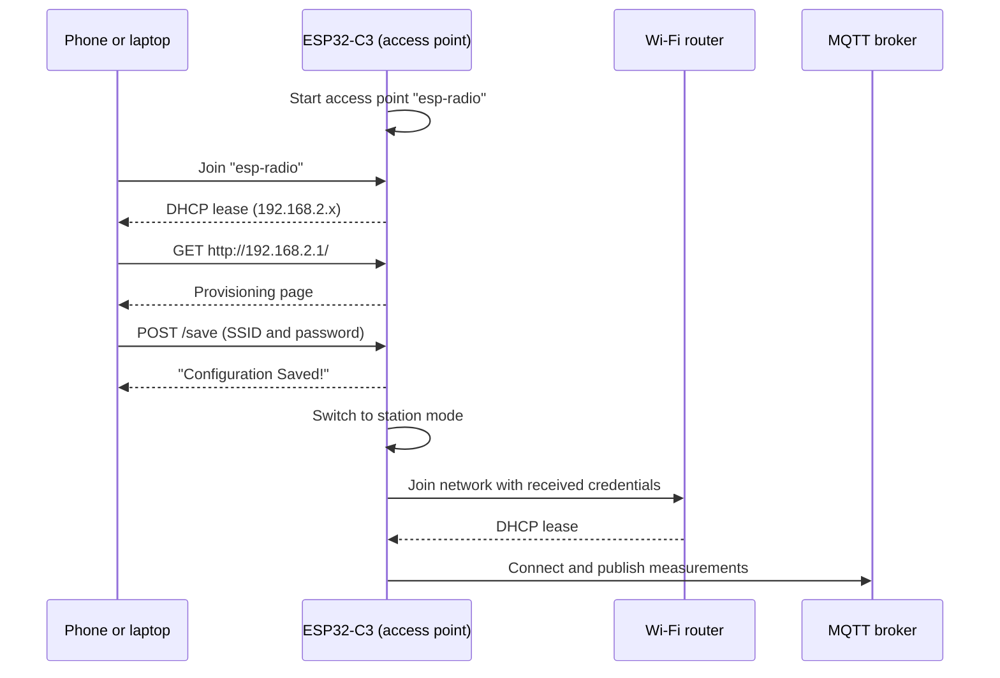

# Wi-Fi Provisioning

In this chapter we remove the compile-time Wi-Fi credentials. Instead, the board starts its own access point and serves a small web page where you enter the network name and password. Once the credentials arrive, the board leaves access point mode, joins the network, and publishes sensor data to the MQTT broker as before. The completed code for this chapter is available in `project/part4/`.

The I2C setup, the heap, and the MQTT task from [Publishing Data to an MQTT Broker](./publishing-data.md) stay mostly the same. The MQTT task now also publishes humidity to `measurement/humidity`. The main changes are a second network stack, a set of small servers that run on the device, and a channel that hands the credentials from the web page to the Wi-Fi connection task.

## What Is Wi-Fi Provisioning?

So far, `SSID` and `PASSWORD` were read with `env!` and baked into the firmware. That works on a development desk, but it does not scale to real devices:

- Every network requires a different firmware image.
- The person installing the device usually cannot rebuild and flash firmware.
- Changing the router or the password means reflashing the device.

**Wi-Fi provisioning** is the process of delivering network credentials to an unconfigured device at runtime. The firmware is the same for every unit, and the user supplies the credentials during setup.

There are several ways to get credentials onto a device, but the two most common are:

- **Access point (SoftAP)**: the device creates its own Wi-Fi network. The user connects to it with a phone or laptop and enters the credentials, either in a web page served by the device or in a companion app.
- **Bluetooth Low Energy (BLE)**: the device advertises over BLE, and a phone app sends the credentials over a BLE connection. The device's Wi-Fi radio never has to act as an access point, and the phone stays connected to its own network during setup.

ESP-IDF supports both transports in its [unified provisioning][idf-provisioning] framework, and Espressif provides companion apps for Android and iOS.

In this chapter we use the access point approach with a web page. It needs nothing on the user's side except a browser, and it only uses the Wi-Fi stack we already have.

The provisioning flow looks like this:



## Station and Access Point Modes

The Wi-Fi radio can play two roles:

- In **station (STA) mode**, the device is a client that joins an existing network. This is what we used in the previous chapters.
- In **access point (AP) mode**, the device *is* the network. Other devices find its SSID, join it, and talk to it directly.

Provisioning needs both: AP mode to receive the credentials, then STA mode to use them.

### Two Interfaces, Two Network Stacks

[`esp_radio::wifi::new`][wifi-new] already returned more than the station interface. In this chapter we use both the access point and the station [`Interfaces`][wifi-interfaces]:

```rust,ignore
{{#shiftinclude auto:../../project/part4/src/main.rs:wifi_interfaces}}
```

Each interface is a separate network device, so each one gets its own `embassy-net` stack:

```rust,ignore
{{#shiftinclude auto:../../project/part4/src/main.rs:network_stacks}}
```

The two stacks are configured differently:

```rust,ignore
{{#shiftinclude auto:../../project/part4/src/network.rs:stack_configs}}
```

- The **station stack** uses DHCP, exactly as before, because the router assigns its address.
- The **access point stack** uses a static address. There is no router on the device's own network, so nobody else can hand it an address. The device is the gateway of a `/24` subnet and uses the gateway address for itself.

The gateway address defaults to `192.168.2.1` and can be overridden at compile time with `GATEWAY_IP`:

```rust,ignore
{{#shiftinclude auto:../../project/part4/src/main.rs:gateway_ip}}
```

The access point stack also needs more sockets than the station stack, because it hosts servers for DHCP, DNS, and HTTP:

```rust,ignore
{{#shiftinclude auto:../../project/part4/src/network.rs:ap_stack}}
```

The station stack keeps the `StackResources<3>` from the previous chapters. Both stacks still need `StaticCell`, for the same `'static` lifetime reasons described in [Wi-Fi Connectivity](./wifi-connectivity.md#why-the-stack-resources-are-static).

### Configuring the Controller

The interfaces only carry frames. The [`WifiController`][wifi-controller] decides which role the radio plays, and the `connection` task starts it in access point mode:

```rust,ignore
{{#shiftinclude auto:../../project/part4/src/network.rs:ap_mode}}
```

[`AccessPointConfig`][ap-config] defaults to an open network on channel 1. We only change the SSID to `esp-radio`, which is the network you will join from your phone or computer.

After the credentials arrive, the same task replaces the configuration with a [`StationConfig`][sta-config]:

```rust,ignore
{{#shiftinclude auto:../../project/part4/src/network.rs:station_mode}}
```

[`set_config`][set-config] restarts Wi-Fi in the new mode, so the access point disappears and the provisioning page is no longer reachable. The station then connects and reconnects with the same loop used in the previous chapters.

> `esp-radio` also supports running both roles at once with [`Config::AccessPointStation`][wifi-config]. This would let the portal stay up while the device tries the new credentials, for example to report a wrong password back to the user. We keep the two phases separate to keep the example small.

## Tasks and Why We Need Them

The application now has seven concurrent activities. `main` initializes the hardware, creates the shared resources, and spawns most of the tasks:

```rust,ignore
{{#shiftinclude auto:../../project/part4/src/main.rs:spawn_tasks}}
```

| Task                 | Stack | Responsibility                                                              |
| -------------------- | ----- | --------------------------------------------------------------------------- |
| `connection`         | —     | Owns the `WifiController`, starts the access point, then switches to station mode. |
| `net_task`           | AP    | Polls the access point stack's `Runner`.                                    |
| `sta_net_task`       | STA   | Polls the station stack's `Runner`.                                         |
| `run_dhcp`           | AP    | Hands out IP addresses to clients that join the access point.               |
| `run_captive_portal` | AP    | Answers DNS queries with the device's own address.                          |
| `run_http_server`    | AP    | Serves the provisioning page and receives the credentials.                  |
| `mqtt_task`          | STA   | Reads the sensor and publishes measurements, as in the previous chapter.    |

Each of these is a loop that never finishes. Most of them spend their time waiting for a packet, a connection, or a message. Because they are separate Embassy tasks, the executor runs whichever one has work to do, and the waiting ones cost nothing. A single sequential `main` could not wait for an HTTP request, answer DHCP, and poll two network stacks at the same time.

### Two Runner Tasks

Every `embassy-net` stack needs its `Runner` to be polled continuously, so we need one runner task per stack:

```rust,ignore
{{#include ../../project/part4/src/network.rs:runner_tasks}}
```

The two functions are identical. They exist separately because a function marked with [`#[embassy_executor::task]`][embassy-task] has a fixed-size, statically allocated task pool, and its default size is one. Spawning `net_task` a second time would fail. An alternative is `#[embassy_executor::task(pool_size = 2)]`, but two named tasks make it clearer which runner belongs to which stack.

### Servers on the Access Point

A phone that joins `esp-radio` expects the same services a normal router provides. The provisioning tasks provide the minimum set, using crates from the [`edge-net`][edge-net] family that run on top of `embassy-net` through [`edge-nal-embassy`][edge-nal-embassy].

`run_dhcp` uses [`edge-dhcp`][edge-dhcp] to assign addresses to clients. Without it, the user would have to configure a static IP address by hand before reaching the page:

```rust,ignore
{{#shiftinclude auto:../../project/part4/src/http.rs:dhcp_server}}
```

`run_captive_portal` uses [`edge-captive`][edge-captive], a DNS server that answers every query with the gateway address. Its purpose is to make every hostname lead to the provisioning page:

```rust,ignore
{{#shiftinclude auto:../../project/part4/src/http.rs:captive_dns}}
```

`run_http_server` uses [`edge-http`][edge-http] to serve the provisioning page on port 80:

```rust,ignore
{{#shiftinclude auto:../../project/part4/src/http.rs:http_server}}
```

`main` spawns the HTTP server only after the access point stack is up and configured, and then logs the instructions for joining the portal:

```rust,ignore
{{#shiftinclude auto:../../project/part4/src/main.rs:portal_ready}}
```

The `mqtt_task` is spawned immediately, but it does nothing useful yet. Its first step is `stack.wait_link_up()` on the station stack, so it waits until provisioning is complete and the station has joined the network.

### Captive Portals

When a phone or laptop joins a new network, the operating system requests a well-known URL, such as `/generate_204` on Android or `/connecttest.txt` on Windows, to check for Internet access. Public hotspots use this check to open a sign-in page automatically. This is called a **captive portal**.

The HTTP handler redirects those probe URLs to the provisioning page:

```rust,ignore
{{#shiftinclude auto:../../project/part4/src/http.rs:captive_paths}}
```

For the operating system to send its probe to the device, the client must use the device as its DNS server. In this project, the DNS responder listens on UDP port `8853`, while clients send DNS queries to the standard port `53`, and the DHCP server does not advertise a DNS server. As a result, the portal page does not open automatically: you open it yourself at `http://192.168.2.1/`.

### Passing Credentials Between Tasks

The HTTP server receives the credentials, but the `connection` task owns the `WifiController`. The two tasks communicate through an [`embassy-sync` `Channel`][embassy-channel]:

```rust,ignore
{{#shiftinclude auto:../../project/part4/src/main.rs:credentials_channel}}
```

The channel has a capacity of one message, because we only need a single set of credentials. It uses a `CriticalSectionRawMutex`, which is safe to share between tasks and interrupts. Like the stack resources, it lives in a `StaticCell` so both tasks can hold a `&'static` reference.

The message type is a small struct:

```rust,ignore
{{#include ../../project/part4/src/network.rs:wifi_credentials}}
```

The fields are fixed-capacity [`heapless::String`][heapless-string]s sized to the Wi-Fi limits: an SSID is at most 32 bytes, and a WPA2 passphrase is at most 63 characters, or 64 hexadecimal digits. Deriving `Deserialize` lets the HTTP handler build the struct directly from the JSON request body. The `serde` feature on `heapless` makes this possible.

The `connection` task waits on the receiving end:

```rust,ignore
{{#shiftinclude auto:../../project/part4/src/network.rs:receive_credentials}}
```

`receive().await` suspends the task until a message arrives, without polling. The two-second delay gives the HTTP server time to finish sending the confirmation page before the access point shuts down.

## Serving the Provisioning Page

The HTTP handler matches on the request method and path. A `GET /` returns the provisioning page:

```rust,ignore
{{#shiftinclude auto:../../project/part4/src/http.rs:home_route}}
```

`GET /saved` returns the confirmation page in the same way. Any other path returns `404 Not Found`.

The form submits the credentials as JSON to `POST /save`:

```rust,ignore
{{#shiftinclude auto:../../project/part4/src/http.rs:save_route}}
```

The handler reads the body into a 256-byte buffer and parses it with [`serde-json-core`][serde-json-core], a `no_std` JSON parser that does not allocate. If parsing succeeds, the credentials are sent through the channel and the handler replies with the confirmation page. If the body is empty or not valid JSON, the handler replies with `400 Bad Request`.

> The handler logs the received password at the `debug` level. That is useful while learning, but a real product should never log secrets.

## HTML Templates

The two pages live in `project/part4/assets/templates/`:

- `home.html` is the provisioning form with SSID and password fields.
- `saved.html` is the confirmation page shown after the credentials are submitted.

There is no file system on the device. Instead, [`include_str!`][include-str] embeds both files in the firmware at compile time:

```rust,ignore
{{#include ../../project/part4/src/http.rs:templates}}
```

`CARGO_MANIFEST_DIR` is the directory that contains `Cargo.toml`, so the paths do not depend on the directory from which you run Cargo. The pages become `&'static str` constants stored in flash, and the handler writes their bytes directly to the TCP connection.

Keep a few things in mind when editing them:

- Despite the directory name, the pages are not processed by a template engine. They are served exactly as written.
- Changes require a rebuild and reflash, because the HTML is part of the firmware image.
- `home.html` displays `esp-radio` and `192.168.2.1` as plain text. If you change the access point SSID or `GATEWAY_IP`, update the page as well.
- The form uses a small JavaScript `fetch` call to send JSON rather than the browser's default form encoding. This is what lets the firmware parse the body with `serde-json-core` into `WifiCredentials`. On success, the script navigates to `/saved`.
- Every byte of HTML and CSS increases the size of the firmware. Inline styles and no external resources keep the pages self-contained, which matters because the client has no Internet access while connected to the access point.

## Running the Application

Start the MQTT broker from the repository root:

```shell
cargo xtask mqtt-server
```

In another terminal, change to `project/part4/` and flash the application. `SSID` and `PASSWORD` are no longer needed:

```shell
HOST_IP="your-ip" cargo run --release
```

Replace `your-ip` with the host IP printed by `cargo xtask mqtt-server`. `BROKER_PORT` works as in the previous chapter, and `GATEWAY_IP` changes the address of the provisioning portal.

After boot, the serial monitor shows the portal instructions:

```text
INFO - WiFi AP started!
INFO - Starting Captive Portal DNS server on port 8853
INFO - WiFi Provisioning Portal Ready
INFO - 1. Connect to the AP: `esp-radio`
INFO - 2. Navigate to: http://192.168.2.1/
INFO - Starting HTTP server on port 80
```

Then provision the device:

1. On a phone or computer, join the open Wi-Fi network `esp-radio`.
2. Open `http://192.168.2.1/` in a browser. Use `http://`, not `https://`.
3. Enter the SSID and password of the network on which the MQTT broker is reachable, then select **Save Configuration**.
4. Reconnect your phone or computer to its usual network. The `esp-radio` network disappears once the device switches to station mode.

The serial monitor shows the switch to station mode, followed by the MQTT connection and the sensor readings:

```text
INFO - Credentials received! SSID: your-ssid
INFO - Connecting to WiFi network...
INFO - Successfully connected to WiFi!
INFO - connecting to MQTT broker at 192.168.1.10:1884...
INFO - connected!
INFO -   24.31 °C | 42.18 %RH
```

The broker terminal now prints both topics:

```text
Topic: measurement/temperature | Payload: 24.31
Topic: measurement/humidity | Payload: 42.18
```

If the password is wrong, the `connection` task keeps retrying every five seconds. Reset the board to start the provisioning portal again.

## Limitations

This example shows the core of Wi-Fi provisioning, but it leaves out several things a product would need:

- **The credentials are not persisted.** They only live in RAM, so every reset starts the provisioning portal again. A real device would store them in flash and only start the portal when no valid credentials are stored.
- **The access point is open.** Anyone nearby can join it and submit credentials, and the password travels in plain HTTP. Protecting the access point with a WPA2 password, or using a provisioning protocol with its own encryption, such as the security schemes in ESP-IDF's provisioning component, would address this.
- **There is no feedback on failure.** The access point is gone by the time the device tries the credentials, so the user cannot see a connection failure on the page.

At this point the device no longer needs credentials at compile time: the same firmware can join any network. In the next chapter we will look at updating that firmware in the field with [Over-the-Air Updates](./ota-updates.md).

[idf-provisioning]: https://docs.espressif.com/projects/esp-idf/en/latest/esp32c3/api-reference/provisioning/provisioning.html
<!-- TODO: Use /latest/ when new docs are redeployed -->
[wifi-new]: https://docs.espressif.com/projects/rust/esp-radio/0.18.0/esp32c3/esp_radio/wifi/fn.new.html
[wifi-interfaces]: https://docs.espressif.com/projects/rust/esp-radio/0.18.0/esp32c3/esp_radio/wifi/struct.Interfaces.html
[wifi-controller]: https://docs.espressif.com/projects/rust/esp-radio/0.18.0/esp32c3/esp_radio/wifi/struct.WifiController.html
[wifi-config]: https://docs.espressif.com/projects/rust/esp-radio/0.18.0/esp32c3/esp_radio/wifi/enum.Config.html
[set-config]: https://docs.espressif.com/projects/rust/esp-radio/0.18.0/esp32c3/esp_radio/wifi/struct.WifiController.html#method.set_config
[ap-config]: https://docs.espressif.com/projects/rust/esp-radio/0.18.0/esp32c3/esp_radio/wifi/ap/struct.AccessPointConfig.html
[sta-config]: https://docs.espressif.com/projects/rust/esp-radio/0.18.0/esp32c3/esp_radio/wifi/sta/struct.StationConfig.html
[embassy-task]: https://docs.rs/embassy-executor/0.10.0/embassy_executor/attr.task.html
[embassy-channel]: https://docs.rs/embassy-sync/0.8.0/embassy_sync/channel/struct.Channel.html
[edge-net]: https://github.com/sysgrok/edge-net
[edge-nal-embassy]: https://docs.rs/edge-nal-embassy/0.8.1/edge_nal_embassy/
[edge-dhcp]: https://docs.rs/edge-dhcp/0.7.0/edge_dhcp/
[edge-captive]: https://docs.rs/edge-captive/0.7.0/edge_captive/
[edge-http]: https://docs.rs/edge-http/0.7.0/edge_http/
[heapless-string]: https://docs.rs/heapless/0.9.3/heapless/string/type.String.html
[serde-json-core]: https://docs.rs/serde-json-core/0.6.0/serde_json_core/
[include-str]: https://doc.rust-lang.org/core/macro.include_str.html
